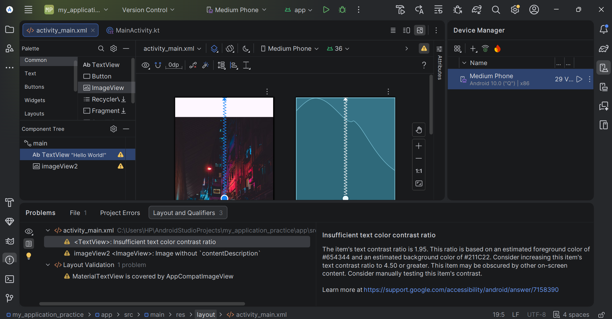
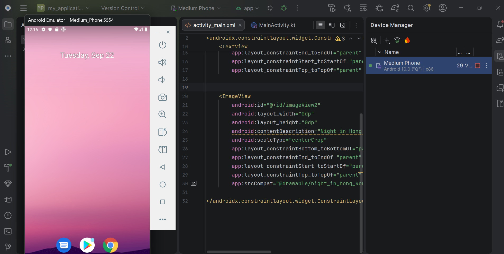
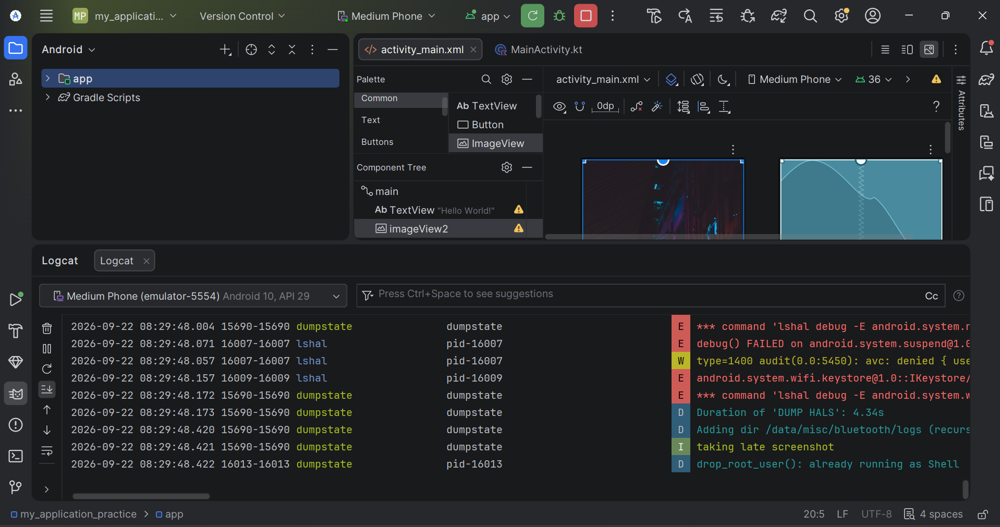
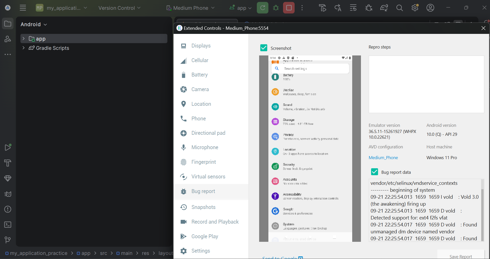

# Android Studio Practice Journey – Complete Insight

A hands-on exploration of Android Studio focusing on **ConstraintLayout**, accessibility, ImageView usage, emulator testing, and common layout warnings.

---

## 📸 Project Screenshots

### 1. Layout Editor & Constraint / Accessibility Warnings


**What this shows:**
- Design + Blueprint view of `activity_main.xml`
- Full-screen ImageView + “Hello World!” TextView
- Problems panel highlighting:
  - Insufficient text color contrast ratio (1.95)
  - Image without `contentDescription`
  - MaterialTextView covered by AppCompatImageView

---

### 2. XML Code + Running Emulator


**What this shows:**
- The `ImageView` constraints and attributes in code
- `android:contentDescription="Night in Hong Kong"` already added
- `app:srcCompat="@drawable/night_in_hong_kong"`
- Live emulator (Medium Phone) running alongside the editor

---

### 3. Logcat Output


**What this shows:**
- Real-time Logcat from the Medium Phone emulator (API 29)
- System-level messages (`lshal`, `dumpstate`, SELinux audits, etc.)
- Learning to filter noise and focus on relevant logs

---

### 4. Emulator Extended Controls & Bug Report


**What this shows:**
- Extended Controls panel of the emulator
- Bug report generation feature
- Device information (Android 10 / API 29, Medium_Phone AVD)

---

## 🛠 Key Experiences & Skills Gained

### Layout Design with ConstraintLayout
- Built a root `ConstraintLayout`
- Made an `ImageView` fill the entire screen using:
  ```xml
  android:layout_width="0dp"
  android:layout_height="0dp"
  app:layout_constraintTop_toTopOf="parent"
  app:layout_constraintBottom_toBottomOf="parent"
  app:layout_constraintStart_toStartOf="parent"
  app:layout_constraintEnd_toEndOf="parent"
  android:scaleType="centerCrop"